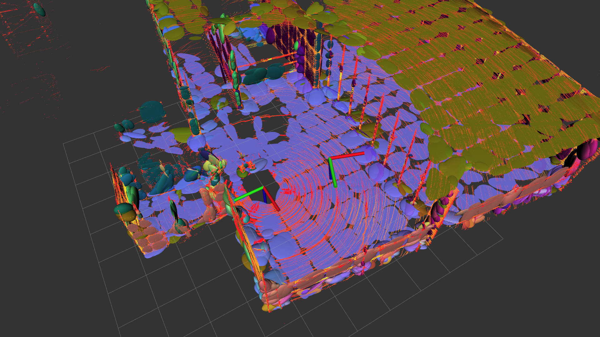
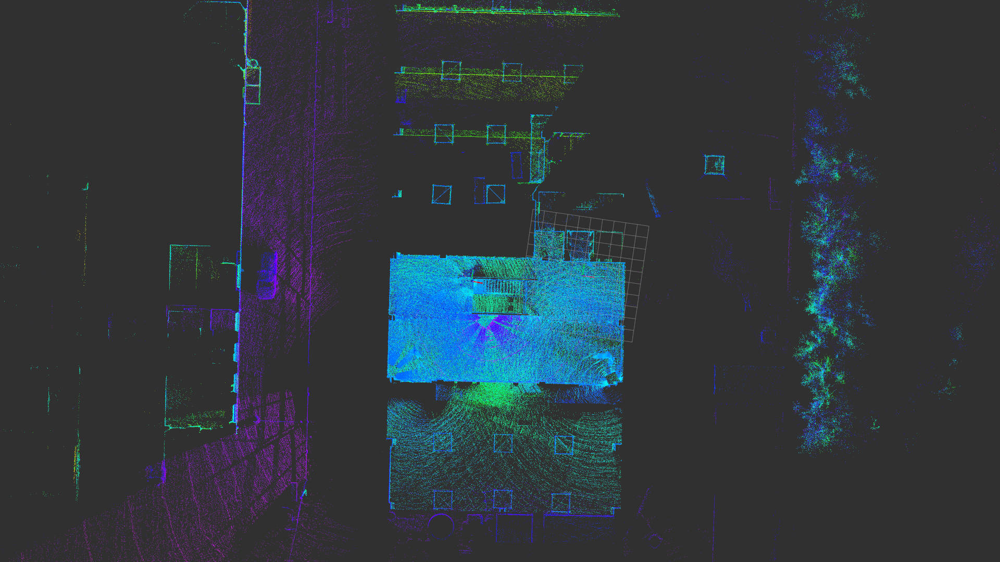

# Wildcat SLAM

This is an unofficial demonstrative implentation of Wildcat SLAM which is described in the following paper:  
```
@article{ramezani2022wildcat,
  title={Wildcat: Online continuous-time 3d lidar-inertial slam},
  author={Ramezani, Milad and Khosoussi, Kasra and Catt, Gavin and Moghadam, Peyman and Williams, Jason and Borges, Paulo and Pauling, Fred and Kottege, Navinda},
  journal={arXiv preprint arXiv:2205.12595},
  year={2022}
}
```




## 1. Prerequisites
### 1.1 **Ubuntu** and **ROS**
Recommend: Ubuntu 20.04 and [ROS Noetic](http://wiki.ros.org/ROS/Installation).

### 1.2. Dependencies
**Ceres Solver**
```shell
sudo apt install libceres-dev
```
**PCL**
```shell
sudo apt install libpcl-dev
```
**fmt**
```shell
sudo apt install libfmt-dev
```
**libbenchmark-dev**
```shell
sudo apt install libbenchmark-dev
```
**protobuf**
```shell
sudo apt install protobuf-compiler
```

## 2. Build Wildcat SLAM
Clone the repository and catkin_make.

## 3. License
GPLv3.
